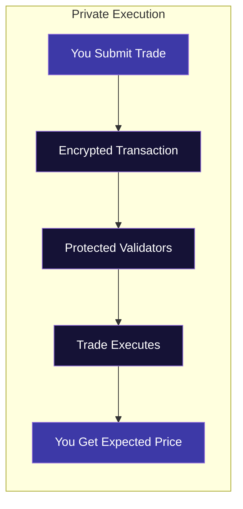
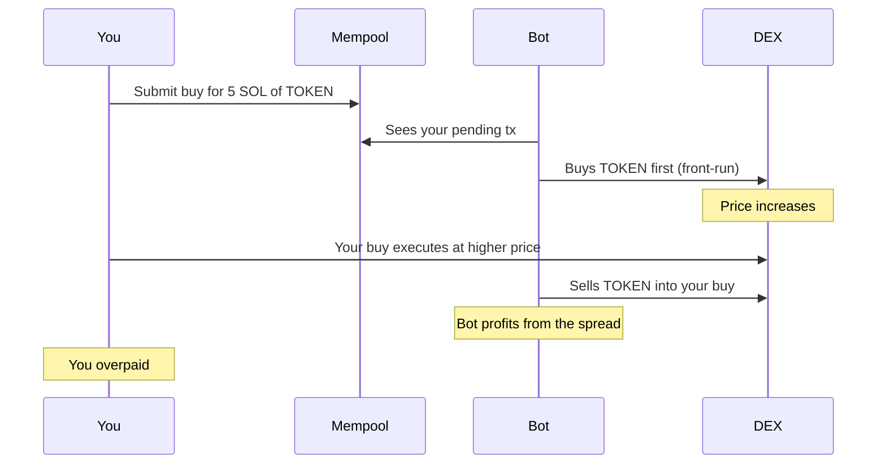
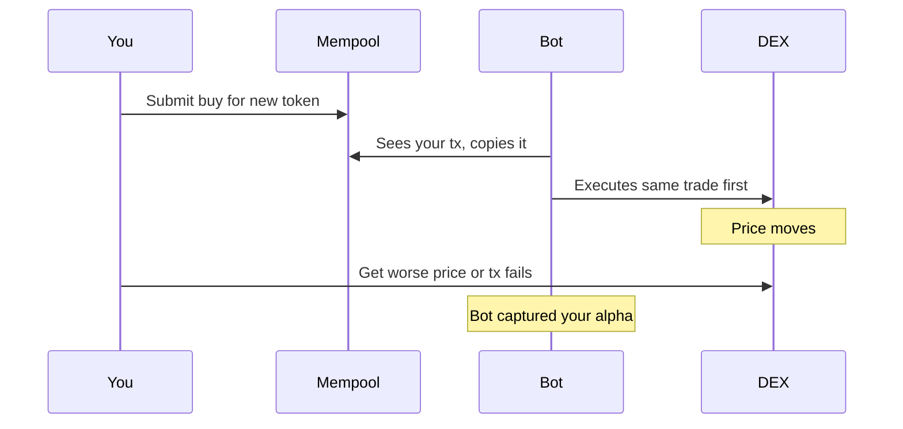
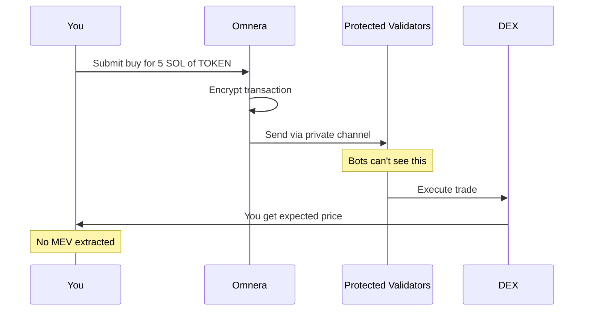

## The Problem

You find a great entry. You submit your trade. But before it executes:

1. A bot sees your pending transaction
2. It buys before you, pushing the price up
3. Your trade executes at a worse price
4. The bot sells into your buy

**You just got sandwiched.** The bot made money. You paid for it.

This happens constantly on Solana. MEV bots extract millions from traders every month — and most traders don't even realize it's happening.

## The Solution

Every trade routed through Omnera is MEV-protected.

<CardGroup cols={2}>
  <Card title="No Front-Running" icon="person-running">
    Bots can't see your trade before it executes.
  </Card>
  <Card title="No Sandwich Attacks" icon="burger">
    Your transaction can't be wrapped by predatory trades.
  </Card>
  <Card title="Price You Expect" icon="tag">
    The price you see is the price you get.
  </Card>
  <Card title="Keep Your Profits" icon="piggy-bank">
    Stop paying the invisible tax to MEV bots.
  </Card>
</CardGroup>

## How It Works

<Frame>

</Frame>

<Steps>
  <Step title="You Submit a Trade">
    Buy or sell through Omnera's interface.
  </Step>
  <Step title="Private Routing">
    Your transaction is encrypted and sent directly to validators who commit to not extracting MEV.
  </Step>
  <Step title="Protected Execution">
    Your trade executes without bots seeing it in the public mempool.
  </Step>
  <Step title="You Keep the Value">
    No sandwich. No front-run. The price you saw is the price you got.
  </Step>
</Steps>

## Always On

Private Execution is enabled by default on all Omnera trades. You don't need to toggle anything or pay extra. Every swap, every trade — protected.

## The Invisible Tax

Most traders don't realize how much they lose to MEV:

| Trade Size | Typical MEV Loss | Per Month (20 trades) |
|------------|------------------|----------------------|
| 1 SOL | 0.5-2% | 0.1-0.4 SOL |
| 5 SOL | 1-3% | 1-3 SOL |
| 10+ SOL | 2-5% | 4-10 SOL |

<Info>
  Larger trades attract more MEV attention. The bots know a 10 SOL buy will move price more than a 1 SOL buy — so they front-run it harder.
</Info>

These percentages add up. Over a month of active trading, MEV can eat a significant portion of your profits — or turn winning strategies into losing ones.

## What MEV Looks Like

### Sandwich Attack

A sandwich attack wraps your trade between two bot transactions to extract value:

<Frame>

</Frame>

### Front-Running

Front-running is when a bot copies your trade and executes it before you:

<Frame>

</Frame>

## How Private Execution Protects You

With Omnera, your transaction never enters the public mempool where bots can see it:

<Frame>

</Frame>

## FAQ

<AccordionGroup>
  <Accordion title="Is there additional cost?" icon="coins">
    No. Private Execution is included in standard Omnera trading fees.
  </Accordion>
  <Accordion title="Is it slower?" icon="clock">
    Negligible difference — typically 50-100ms additional latency. Unnoticeable in practice.
  </Accordion>
  <Accordion title="Does it work for all tokens?" icon="list-check">
    Yes. Any Solana token traded through Omnera gets MEV protection.
  </Accordion>
  <Accordion title="Can I disable it?" icon="toggle-off">
    Yes, though we don't recommend it. Some traders want raw mempool access for specific strategies.
  </Accordion>
  <Accordion title="How do I know it's working?" icon="shield-check">
    Protected trades show a shield icon in your transaction history. You can compare your execution price to the market price at time of submission.
  </Accordion>
</AccordionGroup>

## The Bottom Line

You find the trades. You take the risk. You should keep the profits.

Private Execution ensures the value you create stays with you — not with bots that contribute nothing except extraction.
