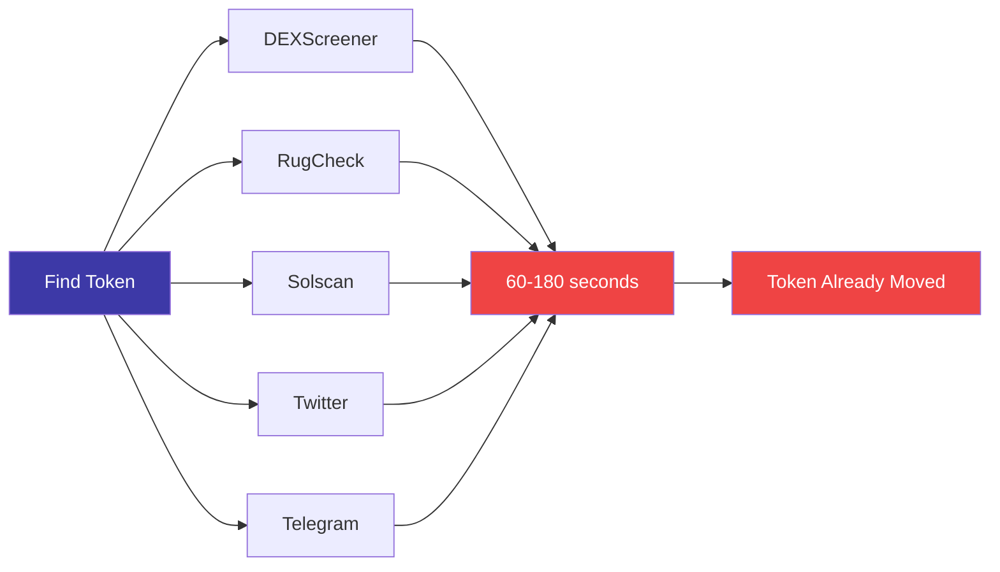
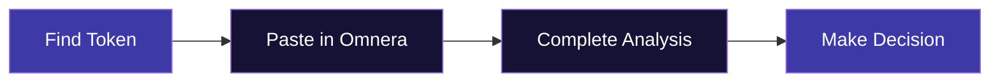
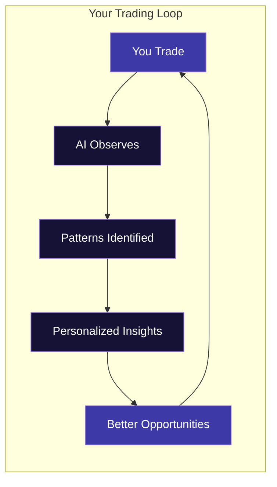

## The Problem

You find a token. Now what?

Open DEXScreener. Check the contract on RugCheck. Look up the creator wallet. Scan holder distribution. Check Twitter. Look at Telegram. Maybe cross-reference with similar tokens that pumped or rugged.

**60-180 seconds later**, you've got 6+ tabs open and the token already moved. Or worse — you FOMO'd in with zero context and got burned.

<Frame>

</Frame>

## The Solution

Omnera gives you everything in under 3 seconds:

<Frame>

</Frame>

<CardGroup cols={2}>
  <Card title="Contract Safety" icon="shield-check">
    Honeypot detection, mint authority, freeze authority, LP status — instant risk assessment.
  </Card>
  <Card title="Creator History" icon="user-secret">
    What else has this wallet deployed? Track record of their previous tokens.
  </Card>
  <Card title="Wallet Clusters" icon="users">
    Insider wallets, connected addresses, concentration analysis.
  </Card>
  <Card title="Social Signals" icon="hashtag">
    Twitter mentions, Telegram activity, community growth — real-time pulse.
  </Card>
  <Card title="Pattern Matching" icon="magnifying-glass-chart">
    How does this token compare to thousands of similar launches? What happened to them?
  </Card>
  <Card title="AI Summary" icon="robot">
    Plain English analysis: what's good, what's concerning, what to watch.
  </Card>
</CardGroup>

## AI That Learns How YOU Trade

Here's where it gets powerful.

Token Intelligence doesn't just analyze tokens — **it learns how you trade.**

<Frame>

</Frame>

<Steps>
  <Step title="It Watches Your Patterns">
    Every trade you make teaches the AI about your style. What market caps do you prefer? What holder distributions? What social signals matter to you?
  </Step>
  <Step title="It Identifies Your Edge">
    Ask the AI: *"What do I trade best?"* It tells you. Maybe you crush low-cap launches with strong Twitter presence. Maybe you're better at established tokens with locked liquidity.
  </Step>
  <Step title="It Surfaces Opportunities">
    Over time, Token Intelligence personalizes to YOUR winning patterns — not generic signals. It highlights tokens that match what actually works for you.
  </Step>
  <Step title="It Compounds">
    The more you trade, the smarter it gets. This is compounding AI that works for you, not against you.
  </Step>
</Steps>

## How to Use Token Intelligence

### Quick Search

1. Paste any Solana token address or search by name
2. Get your complete analysis in ~3 seconds
3. Make informed decisions, not emotional ones

### Ask the AI

Token Intelligence isn't just a dashboard — it's conversational. Ask questions like:

- *"Is this token safe to trade?"*
- *"What do I trade best?"*
- *"Show me tokens similar to ones I've profited on"*
- *"What's concerning about this contract?"*

### Risk Indicators

<AccordionGroup>
  <Accordion title="Green — Lower Risk" icon="circle-check">
    Contract verified, liquidity locked, healthy holder distribution, creator has positive history.
  </Accordion>
  <Accordion title="Yellow — Caution" icon="triangle-exclamation">
    Some concerns: concentrated holdings, unlocked liquidity, limited history, or mixed signals.
  </Accordion>
  <Accordion title="Red — High Risk" icon="circle-xmark">
    Significant red flags: honeypot indicators, suspicious wallet activity, creator history of rugs.
  </Accordion>
</AccordionGroup>

<Warning>
  Risk indicators are informational, not financial advice. Always do your own research and never trade more than you can afford to lose.
</Warning>

## No More Tab Chaos

Before Omnera:
- DEXScreener tab
- RugCheck tab
- Solscan tab
- Twitter tab
- Telegram tab
- Holder analysis tab
- **60-180 seconds of context switching**

With Omnera:
- One interface
- **3 seconds**
- Everything you need
