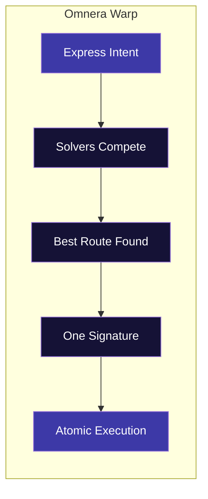
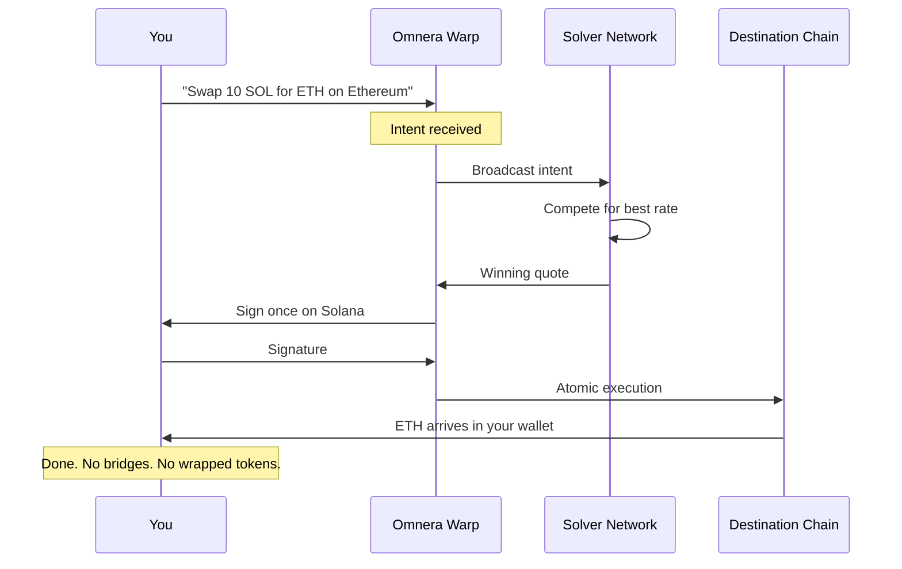

## The Problem With Cross-Chain Today

You want to buy a token on Base using SOL. Here's what that looks like:

1. Find a bridge
2. Hope it's not compromised
3. Wait for the bridge transaction
4. Get wrapped tokens you didn't want
5. Swap wrapped tokens for native
6. Finally make your trade
7. Pay fees at every step

**30+ minutes, multiple transactions, and you're still not sure if you got a good rate.**

<Frame>

</Frame>

## Omnera Warp: Just Say What You Want

With Warp, you express your **intent** — and we handle the rest.

<Note>
**What's an intent?** An intent is simply what you want to happen, without worrying about how it gets done. Instead of manually bridging, swapping, and executing, you just say: *"Swap 10 SOL for ETH on Ethereum"* — and Warp figures out the best way to make it happen.
</Note>

> *"Buy $500 of TOKEN on Base using my SOL"*

One signature. No bridges. No wrapped tokens. No complexity.

<Info>
  **Target Launch**: Q2-Q3 2026
</Info>

## How Warp Works

<Frame>

</Frame>

<CardGroup cols={2}>
  <Card title="Intent-Based" icon="wand-magic-sparkles">
    Tell Omnera what you want. Not how to do it.
  </Card>
  <Card title="No Bridges" icon="bridge-water">
    Direct cross-chain execution without traditional bridging.
  </Card>
  <Card title="No Wrapped Tokens" icon="gift">
    Native assets on the destination chain. Not synthetic versions.
  </Card>
  <Card title="MEV Protected" icon="shield">
    Private Execution extends to cross-chain trades.
  </Card>
</CardGroup>

## The Warp Flow

<Frame>

</Frame>

<Steps>
  <Step title="Express Your Intent">
    Tell Warp what you want in plain terms: *"Swap 10 SOL for ETH on Ethereum"* or *"Buy TOKEN on Arbitrum using USDC on Solana"*
  </Step>
  <Step title="Solvers Compete">
    Our decentralized solver network competes to find you the best execution across all available routes. Competition = better rates for you.
  </Step>
  <Step title="One Signature">
    Sign once on Solana. That's it. No multi-step approvals, no chain switching.
  </Step>
  <Step title="Atomic Execution">
    Your intent executes atomically. Either it all happens, or none of it does. No stuck funds, no partial fills.
  </Step>
</Steps>

## Planned Chain Support

<Warning>
  Omnera Warp is on our roadmap for Q2-Q3 2026. The chains below are planned for launch — not currently available.
</Warning>

| Chain | Launch Status |
|-------|---------------|
| Solana | Primary chain |
| Ethereum | At launch |
| Base | At launch |
| Arbitrum | At launch |
| More L2s | Post-launch |

## Why This Matters

### For Traders

- **Access any opportunity** — Don't miss a trade because your funds are on the wrong chain
- **One interface** — Trade across chains from Omnera without juggling apps
- **Better rates** — Solver competition means you get optimal execution

### No More Bridge Risk

Bridges have lost billions to hacks. Warp's architecture eliminates the traditional bridge attack surface. Your assets move through execution, not custody.

## Example Intents

Here's what trading with intents looks like:

| You Say | Warp Does |
|---------|-----------|
| *"Swap all my SOL for ETH on Ethereum"* | Finds best rate, executes atomically |
| *"Buy 1000 USDC worth of DEGEN on Base"* | SOL → execution → DEGEN, one signature |
| *"Move my portfolio to Arbitrum"* | All assets converted and transferred optimally |

## Technical Architecture

<AccordionGroup>
  <Accordion title="Solver Network" icon="network-wired">
    Decentralized solvers compete to fill your intent. They stake collateral and are slashed for failed executions. Competition drives better rates; skin in the game ensures reliability.
  </Accordion>
  <Accordion title="Atomic Execution" icon="atom">
    Intents either fully complete or fully revert. The solver doesn't get paid unless you get exactly what you asked for. No partial fills, no stuck funds.
  </Accordion>
  <Accordion title="No Custody" icon="key">
    Warp never holds your assets. Execution happens through smart contracts with cryptographic guarantees, not trust in a third party.
  </Accordion>
</AccordionGroup>

## For Developers

Want to build on Warp? The [Warp SDK](/roadmap/warp-sdk) will let you integrate cross-chain execution into your own applications.

## Get Notified

<Card title="Join the Waitlist" icon="bell" href="https://omnera.trade/warp-waitlist">
  Be first to know when Omnera Warp launches.
</Card>
